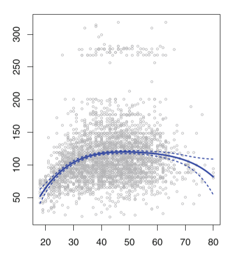
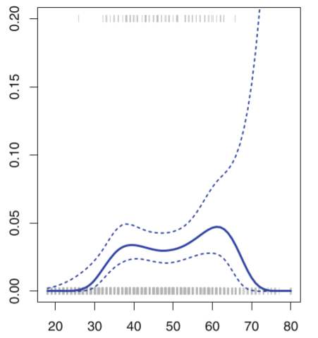
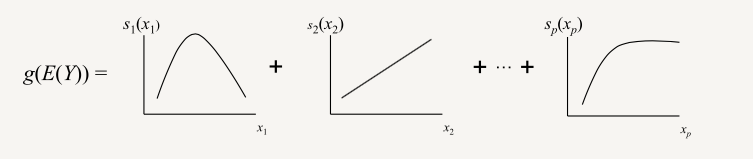
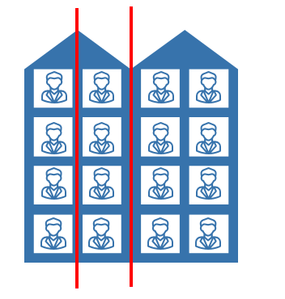

# Regression

## Step 1: collect dataset and select X

    from sklearn import datasets
    boston = datasets.load_boston()     # 返回一个类似于字典的类
    X = boston.data
    y = boston.target
    features = boston.feature_names
    boston_data = pd.DataFrame(X,columns=features)
    boston_data["Price"] = y

## Step 2: select evaluation metrics
- MSE均方误差：measure the average of the squares of the errors

    &space;=&space;\frac{1}{n_\text{samples}}&space;\sum_{i=0}^{n_\text{samples}&space;-&space;1}&space;(y_i&space;-&space;\hat{y}_i)^2.)

    assign more weight to the bigger errors

- RMSE均方根误差: measure the square root of the squares of the errors

    &space;=&space;\sqrt{\frac{1}{n_\text{samples}}&space;\sum_{i=0}^{n_\text{samples}&space;-&space;1}&space;(y_i&space;-&space;\hat{y}_i)^2.})

- MAE平均绝对误差: measure the average of the absolute errors

    &space;=&space;\frac{1}{n_{\text{samples}}}&space;\sum_{i=0}^{n_{\text{samples}}-1}&space;\left|&space;y_i&space;-&space;\hat{y}_i&space;\right|.)

    a linear score which means that all the individual differences are weighted equally in the average

- R^2决定系数：

    &space;=&space;1&space;-&space;\frac{\sum_{i=1}^{n}&space;(y_i&space;-&space;\hat{y}_i)^2}{\sum_{i=1}^{n}&space;(y_i&space;-&space;\bar{y})^2}.)

    range between [0,1]

- 解释方差得分: measure the proportion to which a model accounts for the variation of a given data set
    
    &space;=&space;1&space;-&space;\frac{Var(&space;y&space;-&space;\hat{y})}{Var(y)})


### sklearn的调用
    from sklearn.metrics import mean_squared_error
    from sklearn.metrics import mean_absolute_error
    from sklearn.metrics import r2_score
    from sklearn.metrics import explained_variance_score

    mean_squared_error(y,y_predict)
    mean_squared_error(y,y_predict,squared = False)
    mean_absolute_error(y,y_predict)
    r2_score(y,y_predict)
    explained_variance_score(y, y_predict)

API-evaluation: https://scikit-learn.org/stable/modules/model_evaluation.html#regression-metrics

## Step 3: select the model

### Linear Regression

    - 回归最初的概念：趋于“平均” 

    - 一种预测性的建模技术，研究的是因变量（目标）和自变量（特征）之间的关系

    - 通常用于预测分析，时间序列模型以及发现变量之间的因果关系

    - 使用曲线/线来拟合数据点，目标是使曲线到数据点的距离差异最小

#### Ordinary Least Squares

&space;=&space;\sum\limits_{i=1}^{N}||w^Tx_i-y_i||_2^2=\sum\limits_{i=1}^{N}(w^Tx_i-y_i)^2&space;=&space;(w^TX^T-Y^T)(w^TX^T-Y^T)^T&space;=&space;w^TX^TXw&space;-&space;2w^TX^TY&plus;YY^T)  

solve it by taking the minimum
)  


take the derivative
}{\partial&space;w}&space;=&space;2X^TXw-2X^TY&space;=&space;0)  


^{-1}X^TY)  


#### sklearn的调用
    from sklearn import linear_model    #引入线性回归方法
    linear_reg = linear_model.LinearRegression()    #创建线性回归的类
    linear_reg.fit(X,y)      #输入特征X和因变量y进行训练
    print("coefficient:", linear_reg.coef_)     #输出模型的系数
    print("score:", linear_reg.score(X,y))      #输出模型的评判标准得分,决定系数R^2


#### Disadvantage of linear regression

当数据存在非线性关系时，我们使用线性回归模型进行预测会导致预测性能极其低下，因为模型的形式本身是线性的，无法表达数据中的非线性关系.

**solution1**: 多项式回归


对于多项式的阶数d不能取过大，一般不大于3或者4，因为d越大，多项式曲线就会越光滑，在X的边界处有异常的波动。（图中的边界处的4阶多项式拟合曲线的置信区间(虚线表示置信区间)明显增大，预测效果的稳定性下降。）  



left: d<=4,曲线代表的置信区间较稳定
right: d>4,曲线代表的置信区间明显增大

**sklearn的调用**
API-polynomial: https://scikit-learn.org/stable/modules/generated/sklearn.preprocessing.PolynomialFeatures.html?highlight=poly#sklearn.preprocessing.PolynomialFeatures

For example, if an input sample is two dimensional and of the form [a, b], the degree-2 polynomial features are [1, a, b, a^2, ab, b^2].

    from sklearn.preprocessing import PolynomialFeatures    #generate polynomial and interaction features
    X = [[1,2]]
    poly = PolynomialFeatures(2)
    print(poly.fit_transform(X))
    poly2 = PolynomialFeatures(2,interaction_only = True)
    print(poly2.fit_transform(X))

```python
[[1. 1. 2. 1. 2. 4.]]
[[1. 1. 2. 2.]]
```

**solution2**: GAM(广义可加模型) Generalized Additive Model

an extension of generalized linear models,identify the link of the predictor and variables

ref: https://multithreaded.stitchfix.com/blog/2015/07/30/gam/



&space;&plus;&space;\epsilon_i)

- 本质是线性模型推广至非线性模型的一个框架，在这个框架中，每一个变量都用一个非线性函数来代替

- 模型本身保持整体可加性

- 线性回归、线性分类模型都可适用

- additive nature allows us to explore and interpret individual features by holding others at their mean
    ref: https://codeburst.io/pygam-getting-started-with-generalized-additive-models-in-python-457df5b4705f

**sklearn的调用**
API-GAM: https://pygam.readthedocs.io/en/latest/api/api.html
(GAM,LinearGAM,GammaGAM,InvGaussGAM,LogisticGAM,PoissonGAM,ExpectileGAM)

    from pygam import LinearGAM
    gam = LinearGAM().fit(X, y)
    gam.summary()
    gam.coef_


### Regression Tree 回归树

- 依据分层和分割的方式将特征空间划分为一系列简单的区域

- 将空间用超平面进行划分的一种方法，每次分割，都将当前的空间一分为二，这样使得每一个叶子节点都是在空间中的一个不相交的区域

**步骤**：
    ref: https://blog.csdn.net/weixin_40604987/article/details/79296427

- 将自变量的特征空间(即x^{(1)},x^{(2)},x^{(3)},...,x^{(p)})的可能取值构成的集合分割成J个互不重叠的区域R_1,R_2,...,R_j。        
- 对落入区域R_j的每个观测值作相同的预测，预测值等于R_j上训练集的因变量的简单算术平均。 

如下图所示，假如我们想要对楼内居民的年龄进行回归，将楼划分为3个区域 R1 , R2 , R3(红线),那么 R1的输出就是第一列四个居民年龄的平均值, R2的输出就是第二列四个居民年龄的平均值， R3的输出就是第三、四列八个居民年龄的平均值。


1. 选择最优切分特征j与该特征上的最优切分点s

- 遍历特征j以及固定j后遍历切分点s，选择使得下式最小的(j,s)
- 用选定的(j,s)划分区域，并决定输出值

}(y_i-c_1)^2&space;&plus;&space;min_{c_2}\sum\limits_{x_i\in&space;R_2(j,s)}(y_i-c_2)^2&space;])

2. 


