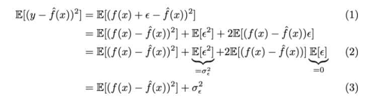
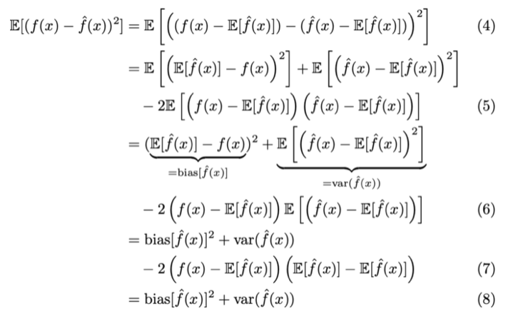

# Optimize the model

## Training set MSE v.s. Testing set MSE

在回归中，我们最常用的评价指标为均方误差

)^2)

- 如果我们所用的数据是训练集上的数据，那么这个误差为训练均方误差，如果我们使用测试集的数据计算的均方误差，我们称为测试均方误差。

- 一般而言，我们并不关心模型在训练集上的训练均方误差，我们关心的是模型面对未知的样本集，即测试集上的测试误差，我们的目标是使得我们建立的模型在测试集上的测试误差最小.

## Overfitting v.s. Underfitting 

- overfitting: 模型在训练误差很小，但是测试均方误差很大

- cannot avoid overfitting, but can minimize overfitting

## Bias-Variance Decomposition

 

 

- (4) add and substract by E[f^hat(x)]

- (5) expand

- (6) pull f(x)-E[f^hat(x)] out of the expectation b/c it's a constant

- (7) linearity of expectation
