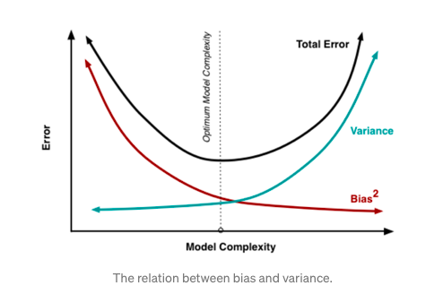

# Optimize the model

## Training set MSE v.s. Testing set MSE

在回归中，我们最常用的评价指标为均方误差

)^2)

- 如果我们所用的数据是训练集上的数据，那么这个误差为训练均方误差，如果我们使用测试集的数据计算的均方误差，我们称为测试均方误差。

- 一般而言，我们并不关心模型在训练集上的训练均方误差，我们关心的是模型面对未知的样本集，即测试集上的测试误差，我们的目标是使得我们建立的模型在测试集上的测试误差最小.

## Overfitting v.s. Underfitting 

- overfitting: 模型在训练误差很小，但是测试均方误差很大

- cannot avoid overfitting, but can minimize overfitting

## Bias-Variance Decomposition

ref: https://towardsdatascience.com/the-bias-variance-tradeoff-8818f41e39e9

\right)^{2}=\operatorname{Var}\left(\hat{f}\left(x_{0}\right)\right)&plus;\left[\operatorname{Bias}\left(\hat{f}\left(x_{0}\right)\right)\right]^{2}&plus;\operatorname{Var}(\varepsilon))

 

 

- (4) add and substract by E[f^hat(x)]

- (5) expand

- (6) pull f(x)-E[f^hat(x)] out of the expectation b/c it's a constant

- (7) linearity of expectation

**bias**: 期望预测与真实值的偏离程度，即该模型/算法本身的拟合能力

**variance**: 同样大小的训练集的变动所导致的模型性能的变化，即数据变动带来的影响

偏差度量的是单个模型的学习能力，而方差度量的是同一个模型在不同数据集上的稳定性.

## Bias-Variance Dilemma

ref: https://towardsdatascience.com/bias-variance-dilemma-74e5f1f52b12

一般来说，偏差与方差是有冲突的。

 

- dealing with bias and variance is about dealing with underfitting and overfitting. 

- bias is reduced and variance is increased in relation to model complexity.

- low variance (high bias) algorithms turn to be less complex, with simple or rigid underlying structure

- low bias (high variance) algorithms turn to be more complex, with a flexible underlying structure

## Model/Feature Selection

### selection criteria:

**Cp**
)
其中 d=模型个数, )^2$，$\hat{\sigma}^2)

**AIC**
)

**BIC**
d\hat{\sigma}^2))

### cross validation

- 先将数据集划分为k个大小相似的互斥子集，每个子集都尽可能保持数据分布的一致性

- 每次用k-1个子集作为训练集，余下的那个子集作为测试集

- 从而可进行k次训练和测试，最终返回的是这k个测试结果的均值

### regularization

对回归的系数进行约束或者加罚的技巧对p个特征的模型进行拟合，显著降低模型方差，这样也会提高模型的拟合效果

- Ridge Regression(L2)

&space;=&space;\sum\limits_{i=1}^{N}(y_i-w_0-\sum\limits_{j=1}^{p}w_jx_{ij})^2&space;&plus;&space;\lambda\sum\limits_{j=1}^{p}w_j^2)

其中，^{-1}X^TY)

- Lasso(L1)

&space;=&space;\sum\limits_{i=1}^{N}(y_i-w_0-\sum\limits_{j=1}^{p}w_jx_{ij})^2&space;&plus;&space;\lambda\sum\limits_{j=1}^{p}|w_j|,&space;\lambda&space;\ge&space;0)