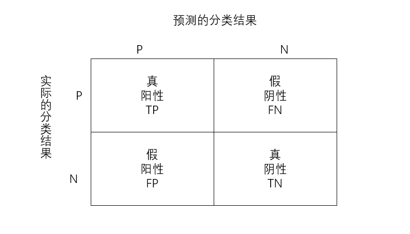
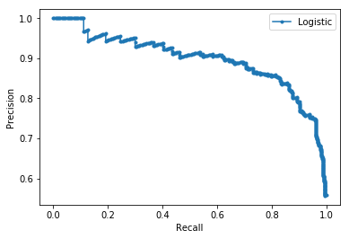

# Classifiers

## Criteria/Performance Measurement

Confusion Matrix:

   - 真阳性TP：预测值和真实值都为正例；                        
   - 真阴性TN：预测值与真实值都为负例；                     
   - 假阳性FP：预测值为正，实际值为负；
   - 假阴性FN：预测值为负，实际值为正；                      
    


1. Accuracy

分类正确的样本数占总样本的比例


2. Precision

预测为正且分类正确的样本占预测值为正的比例


错误率 =  1 - Precision

3. Recall

预测为正且分类正确的样本占类别为正的比例


观察Precision和Recall, 一对矛盾的变量

- 一般来说，higher precision, lower recall 

- Precision-Recall Curve
ref: https://www.geeksforgeeks.org/precision-recall-curve-ml/

ref: https://machinelearningmastery.com/roc-curves-and-precision-recall-curves-for-imbalanced-classification/


**sklearn**
API-PR: https://scikit-learn.org/stable/modules/generated/sklearn.metrics.precision_recall_curve.html

```python
from sklearn.datasets import make_classification
from sklearn.linear_model import LogisticRegression
from sklearn.model_selection import train_test_split
from sklearn.metrics import precision_recall_curve
from matplotlib import pyplot
# generate 2 class dataset
X, y = make_classification(n_samples=1000, n_classes=2, random_state=1)
# split into train/test sets
trainX, testX, trainy, testy = train_test_split(X, y, test_size=0.5, random_state=2)
# fit a model
model = LogisticRegression(solver='lbfgs')
model.fit(trainX, trainy)
# predict probabilities
yhat = model.predict_proba(testX)
# retrieve just the probabilities for the positive class
pos_probs = yhat[:, 1]
# calculate the no skill line as the proportion of the positive class
no_skill = len(y[y==1]) / len(y)
# plot the no skill precision-recall curve
pyplot.plot([0, 1], [no_skill, no_skill], linestyle='--', label='No Skill')
```


```python
# calculate model precision-recall curve
precision, recall, _ = precision_recall_curve(testy, pos_probs)
# plot the model precision-recall curve
pyplot.plot(recall, precision, marker='.', label='Logistic')
# axis labels
pyplot.xlabel('Recall')
pyplot.ylabel('Precision')
# show the legend
pyplot.legend()
# show the plot
pyplot.show()
```
